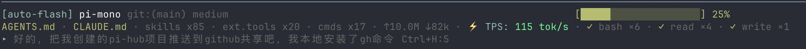

# Pi HUD

> Heads-up display status bar for [pi coding agent](https://pi.dev/) — inspired by [claude-hud](https://github.com/jarrodwatts/claude-hud)
>
> 为 [pi 编程助手](https://pi.dev/) 提供头部显示器（HUD）状态栏，灵感来自 [claude-hud](https://github.com/jarrodwatts/claude-hud)



---

## Features / 功能

**English:**
- **3-line HUD** — model, project, git branch, context usage, elapsed time, skills, extensions, tokens, cost, tool stats, running agents
- **Real-time TPS** — tokens-per-second with sliding window, color-coded speed tiers
- **TTFT** — time-to-first-token measurement (brief or always-on mode)
- **Timer pausing** — TPS freezes during tool execution, resumes automatically
- **Configurable** — toggle each element on/off, customize colors and thresholds
- **Plugin system** — extend with custom HUD items via `pi-hud-plugins/`

**中文：**
- **三行 HUD** — 显示模型、项目名、Git 分支、上下文用量、耗时、技能数、扩展数、Token 消耗、费用、工具统计、运行中的 Agent
- **实时 TPS** — 滑动窗口计算每秒 Token 数，彩色分级显示速度
- **TTFT** — 首 Token 延迟测量（支持短暂显示或常显模式）
- **Timer 暂停** — 工具执行期间 TPS 冻结，完成后自动恢复
- **完全可配** — 每个元素可单独开关，自定义颜色和阈值
- **插件系统** — 通过 `pi-hud-plugins/` 扩展自定义 HUD 项目

---

## Install / 安装

```bash
pi install git:github.com/Mr-Koala/pi-hud
```

Or copy `pi-hud.ts` to `~/.pi/agent/extensions/` and run `/reload`.

或者复制 `pi-hud.ts` 到 `~/.pi/agent/extensions/`，然后 `/reload`。

---

## Configuration / 配置

Edit `.pi/pi-hud.json` (project) or `~/.pi/agent/pi-hud.json` (global):

编辑 `.pi/pi-hud.json`（项目级）或 `~/.pi/agent/pi-hud.json`（全局）：

```json
{
  "tpsDisplay": "ttft",
  "tpsWindow": 1000,
  "tpsEndBehavior": "average",
  "ttftDisplay": "brief",
  "tpsThresholds": { "slow": 0, "medium": 50, "fast": 100, "blazing": 200 },
  "tpsColors": { "slow": "#ff4444", "medium": "#ffaa00", "fast": "#00ff88", "blazing": "#44ddff" }
}
```

### Options / 选项

| Option / 选项 | Default / 默认 | Description / 说明 |
|---|---|---|
| `tpsDisplay` | `"tps"` | Display mode: `tps`, `ttft`, `stats`, `full` / 显示模式 |
| `tpsWindow` | `1000` | Sliding window in ms / 滑动窗口大小（毫秒） |
| `tpsEndBehavior` | `"average"` | End-of-stream TPS: `average` or `last` / 结束后显示平均还是最后速度 |
| `ttftDisplay` | `"brief"` | TTFT visibility: `always` or `brief` (hide after 3s) / TTFT 显示模式 |
| `tpsThresholds` | `{slow:0, medium:15, fast:30, blazing:45}` | Speed tier boundaries / 速度等级阈值 |
| `tpsColors` | hex colors | Speed tier colors / 各速度等级颜色 |

### Commands / 命令

- `/tps` — Cycle TPS display mode: `tps` → `ttft` → `stats` → `full` / 循环切换 TPS 显示模式

---

## Architecture / 架构

```
                ┌──────────────────────────────────────┐
                │         pi runtime                    │
                │  loads ~/.pi/agent/extensions/*.ts   │
                └──────────┬──────────────────────────-┘
                           │ import & execute default()
                           ▼
                ┌──────────────────────────────────────┐
                │         pi-hud.ts                     │
                │                                      │
                │  pi.addComponent()  ──► 每帧渲染     │
                │  pi.on('message_*')  ──► TPS 跟踪    │
                │  pi.on('tool_execution_*') ──► 暂停  │
                │  pi.addCommand('/tps') ──► 模式切换  │
                └──────────────────────────────────────┘
```

The extension hooks into pi's event system — no fork, no core modification needed. See the [sequence diagram](https://github.com/Mr-Koala/pi-hud) for the full flow.

扩展通过事件钩子嵌入 pi 运行环境，无需 fork 源码或修改内核。完整流程图见仓库首页。

---

## License / 许可

MIT
